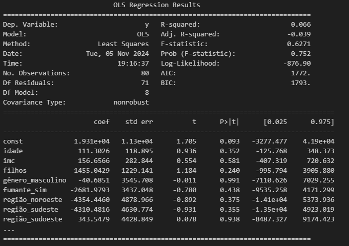
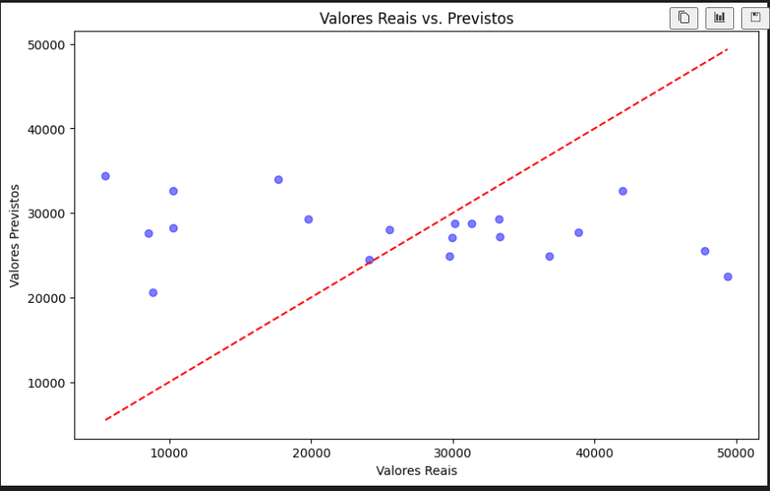

# TECH_CHALLENGE

# Contexto do Dataset: Dados Sintéticos de Custos Médicos

Este dataset foi gerado com dados sintéticos utilizando o **GitHub Copilot**. O Copilot ajudou a criar um conjunto de dados sintéticos que simula informações sobre custos médicos individuais, com base em atributos como idade, gênero, índice de massa corporal (IMC), número de filhos, status de fumante e região de residência.

## Descrição das Colunas
**idade:** Idade do indivíduo, variando entre 18 e 65 anos.
**gênero:** Gênero do indivíduo, categorizado como masculino ou feminino.
**imc:** Índice de Massa Corporal, com valores entre 18.5 e 40.0, representando uma faixa realista para adultos.
**filhos:** Número de filhos, variando de 0 a 4.
**fumante:** Indica se o indivíduo é fumante (sim ou não), um fator que influencia diretamente o custo médico.
**região:** Região de residência, categorizada como nordeste, noroeste, sudeste ou sudoeste.
**encargos:** Custo médico individual gerado aleatoriamente, variando entre 5000 e 50000.

## Objetivo
O objetivo do exercício é construir um modelo de regressão para prever o valor dos encargos (custos médicos individuais) com base nas características fornecidas para cada indivíduo.

## Vantagem dos Dados Sintéticos

O uso de dados sintéticos oferece as seguintes vantagens:

**Privacidade:** Nenhum dado real de saúde ou pessoal é exposto.
**Flexibilidade:** Os dados podem ser ajustados para refletir qualquer distribuição ou característica relevante para o exercício.
**Consistência:** Gera um conjunto de dados balanceado, com características que facilitam a criação de modelos de aprendizado de máquina.


# Parte 2
## Explicação do Pipeline e Escolha dos Algoritmos

No código fornecido, estamos utilizando um pipeline que realiza duas tarefas principais:

### Pré-processamento de dados com o preprocessor, que inclui:

Padronização de variáveis numéricas: Para variáveis como idade, IMC (índice de massa corporal) e número de filhos, é importante escalá-las para uma média zero e variância unitária. Isso é essencial especialmente para modelos que são sensíveis a diferentes escalas nas variáveis, como a regressão linear.

### Codificação de variáveis categóricas: 

Utilizamos OneHotEncoder para transformar variáveis categóricas (como gênero, status de fumante e região) em variáveis binárias (dummy variables). Isso permite que o modelo de regressão utilize as variáveis categóricas de maneira eficiente.
Modelo de Regressão Linear: Utilizamos o algoritmo de Regressão Linear como modelo preditivo no pipeline.

```python
model = Pipeline(steps=[
    ('preprocessor', preprocessor),
    ('regressor', LinearRegression())
])

X_train, X_test, y_train, y_test = train_test_split(X, y, test_size=0.2, random_state=42)

```

###  Estrutura do Pipeline

#### Pipeline:

O pipeline é uma estrutura que organiza todas as etapas de pré-processamento e modelagem. Ele permite que você aplique uma sequência de transformações e, em seguida, ajuste o modelo, facilitando o fluxo de trabalho e a reprodutibilidade.

**Preprocessor (ColumnTransformer):**
Este bloco organiza o pré-processamento das variáveis de entrada, dividindo as transformações entre variáveis numéricas e categóricas, o que é essencial para lidar com diferentes tipos de dados de forma adequada.

**Dentro do preprocessor:**

##### *Num (numéricas):*
As variáveis numéricas, como idade, IMC e número de filhos, são padronizadas usando StandardScaler.
StandardScaler: Esta transformação ajusta as variáveis numéricas para uma média de 0 e uma variância de 1. Isso ajuda a melhorar a performance dos modelos, especialmente em algoritmos sensíveis à escala, como a regressão linear.

##### *Cat (categóricas):*

As variáveis categóricas, como gênero, fumante e região, são processadas usando OneHotEncoder.
OneHotEncoder: Esta transformação converte cada categoria em uma coluna binária (dummy), o que permite que o modelo de regressão linear lide com dados categóricos.

##### Parâmetros de OneHotEncoder:
 
 *drop='first':* Remove a primeira categoria para evitar multicolinearidade, que é útil para modelos lineares.

*handle_unknown='ignore':* Ignora categorias desconhecidas que possam aparecer nos dados de teste, evitando erros durante a previsão.

##### Regressor (LinearRegression):

Após o pré-processamento, os dados transformados são passados para o modelo de Regressão Linear.
LinearRegression: Este modelo é ajustado aos dados para encontrar a melhor linha (ou hiperplano) que minimize a diferença entre os valores previstos e reais. A regressão linear é ideal para problemas onde o objetivo é prever um valor contínuo com base em variáveis independentes.


## Avaliação do Modelo

**RMSE (Root Mean Squared Error)**

Com um RMSE de aproximadamente 14,468, significa que, em média, as previsões do modelo estão errando por cerca de 14,468 unidades de encargos. Esse valor é alto se comparado com o valor médio de "encargos" (caso você tenha uma ideia desse valor), indicando que o modelo está cometendo erros significativos nas previsões

No seu caso, o *𝑅² é -0.247*, o que é um valor muito baixo e negativo. Isso indica que o meu modelo de regressão linear está explicando pior os dados do que uma linha média horizontal, sugerindo que ele está completamente ineficaz em qualquer tarefa de previsão.


### OLS (Ordinary Least Squares)  

Fiz uma análise para identificar se alguma das variáveis teria um impacto estatisticamente significativo, mas conclui que tanto o modelo escolhido quanto os dados gerados não estão adequados. O modelo não conseguiu capturar relações relevantes entre as variáveis, sugerindo que os dados podem precisar de ajustes ou que um modelo mais complexo seria necessário



### Resultado do treinamento

Esse gráfico mostra a comparação entre os valores reais e os valores previstos pelo modelo de regressão. Cada ponto azul representa um par de valor real versus valor previsto. A linha vermelha tracejada indica o alinhamento ideal, onde os valores reais seriam iguais aos valores previstos.

Observamos que muitos pontos estão longe da linha, o que indica que o modelo teve dificuldades em prever os valores com precisão. Essa divergência reflete o baixo desempenho do modelo, confirmado pelos indicadores 𝑅² e RMSE, sugerindo que o modelo não está capturando bem a relação entre as variáveis e a variável alvo.

